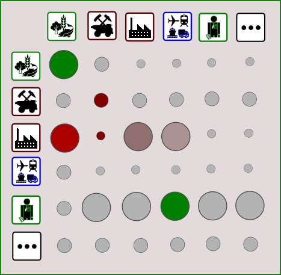

# Leontief

Leontief is a C++/Python toolkit to facilitate working with economic Input-Output models. 



## Overall Functionality Objectives

### Performance versus Usability

The overall design principle behind Leontief is to strike a balance between _usability_ and _performance_ when working with and/or developing algorithms and tools related to economic input-output systems. EEIO systems can vary significantly in size, with the largest models requiring High Performance Computing (HPC) infrastructure to operate. Achieving tolerable performance on commodity computing infrastructure while maintaining usability by a wide range of users is not trivial. A key design decision in this direction is to use **Eigen**, a user-friendly C++ library for vector, matrix, tensor manipulations that offers a higher-level API similar e.g., to that of Matlab. While not as user-friendly as e.g., Python writing standalone scripts to performs various EEIO tasks is relatively straightforward (NB: a Python wrapper might eventually be available).  

### SUT/EEIO and Networek Focus

Leontief helps with a number of typical tasks in Environmentally Extended Input-Output modeling:

* Pre-processing Input-Output tables using command line tools and ingesting IO or SUT matrices into a C++ environment for further calculations.
* Solving typical EEIO problems using a library of tested algorithms. 

Besides standard calculations, Leontief supports investigating ad-hoc research questions by writing new high-level code in the form of scripts. In particular we emphasize graph-oriented tools and calculations.

> A current focus of development is around utilizing the FIGARO dataset but all open databases will be integrated in due course.

## Installation / Workflow

* Clone the repository into your own work environment. 
* The command line scripts included in the leontief/scripts directory should be working immediately on a standard linux distribution (or Windows WSL). 

### Dependencies

A major part of Leontief is a specialized EEIO C++ library that leverages other lower level C++ libraries. To augment or rebuild the library from source you will need to have first a working C++ toolchain that can compile modern C++. 

Conan is recommended as a means to pull in dependencies but is not absolutely required. The current dependency list includes:

* The **eigen** library providing vector,matrix,tensor containers and linear algebra algorithms
* The **poco** library providing general purpose facilities
* The **catch2** library for testing

For compiling the C++ code, Leontief uses **cmake**.

### Testing

There is a suit of catch2 based tests that help verify that everything is installed and running properly.

### Conan Installation

* pip install conan
* conan install . --output-folder=cmake-build-debug --build=missing -s build_type=Debug

### Data Organization

#### Downloading Scripts

Create a leontief/data subdirectory. Download, move and extract publicly available IO databases into the data directory. 

Current download scripts are in the directory leontief/scripts

* [exiobase](scripts/download_exiobase.sh)
* [figaro](scripts/download_figaro.sh)
* [oecd-icio](scripts/download_oecd-icio.sh)

```text
bash scripts/download_oecd-ici.sh
```

#### Pre-processing

The focus of Leontief is on high performance *numerical calculations* involving large matrices. It does not offer dataframe type functionality for searching or filtering data, this is more economically achieved using Python. Yet some preprocessing is required. The following scripts offer needed functionality:

* Strip the matrix files (e.g., bash strip_exiobase.sh) from label data (we will not need those for numerical C++ calculations).

#### IO Systems

IO Systems refers to symmetric input-output tables and models 

#### SUT Systems

SUT Systems refers to supply and use tables and models

#### EEIO Functionality

Both IO and SUT models support EEIO functionality via standard extensions.

## Further Resources

* Working with CLI tools to process large matrices is elaborated further on the eLearning platform [Open Risk Academy](https://www.openriskacademy.com/course/view.php?id=76)


